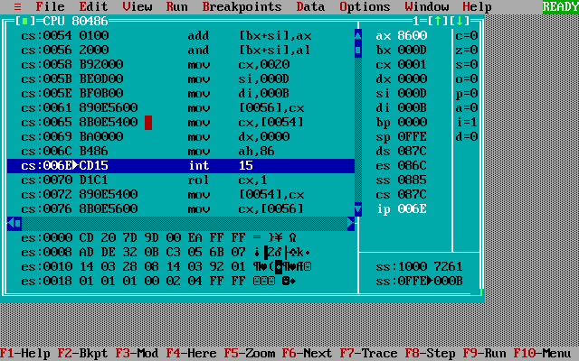
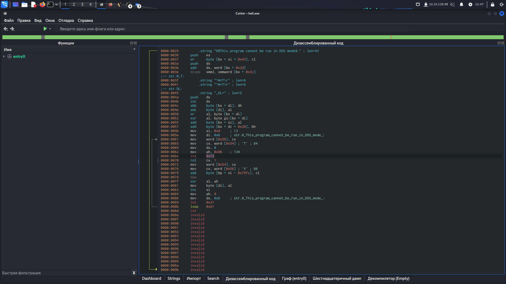
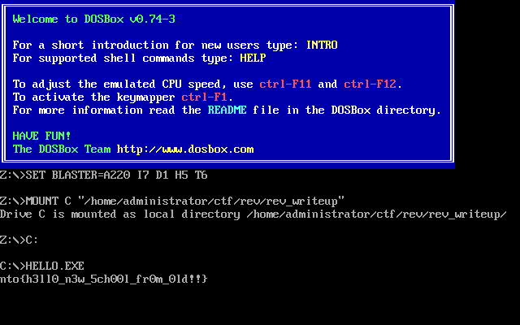

# Reverse-1

После запуска утилиты `file` выясняется, что это исполняемый файл для ОС MS-DOS
```
$ file hello.exe
hello.exe: MS-DOS executable, MZ for MS-DOS
```

После установки dosbox и запуска hello.exe видим, что на экран посимвольно выводится флаг, причем каждый следующий символ выводится медленнее, чем предыдущий.

```
C:\>HELLO.EXE
nto{h3ll0_
```

Установив и запустив turbo debugger (td.exe), выясняем, что "зависание" происходит при выполнении инструкций
```
mov ah, 86
int 15
```



Проведя поиск информации в интернете выясняется, что это прерывание, которое отвечает за задержку. А счетчик, который является аргументом для этого прерывания каждую итерацию цикла увеличивается в разы. То есть чтобы программа вывела весь флаг без задержек нужно отредактировать бинарный файл hello.exe. Иными словами, пропатчить

Для этого можно использовать программу cutter:
* Открыть hello.exe в режиме записи
* Найти нужную инструкцию по смещению `0x0000006e`
* ПКМ - Редактировать - Nop инструкция
* Закрыть cutter



Выполнить команду
```
$ dosbox hello.exe
```
На экране будет отображен весь флаг


