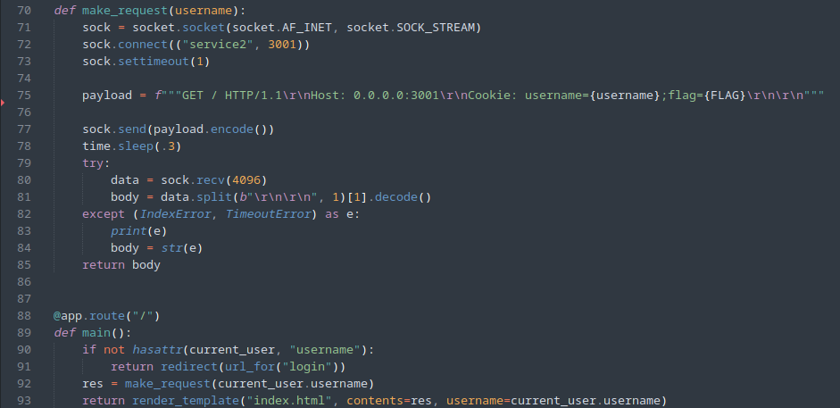
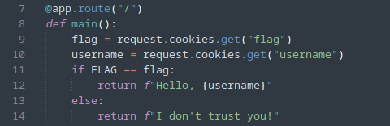

# Web-2

Анализируя исходный код, видим, что при обращении пользователя к корню сайта с 1-го сервера с помощью сокетов отправляется HTTP запрос на 2-й сервер:



В заголовке **Cookie** передается имя зарегистрированного пользователя и флаг, хранящийся на сервере. 2-й сервер проверяет флаг на верность, и, в случае успеха, возвращает *Hello, <имя пользователя>*:



Так как входных точек больше нет, приходим к выводу, что 2-й сервер в ответе должен вернуть флаг. Попробуем протестировать параметр *username* и заметим нестандартный ответ при параметре, содержащем символ \n (New Line):

```
Bad Request

Bare CR or LF found in header line "Cookie: username=evil
;flag=NTO{redacted}"

(generated by waitress)
```

Создим на 1-м сервисе пользователя с именем *evil%0d* и, получив куки авторизованного пользователя, перейдем на главную страницу, где получим флаг.

```
POST /register HTTP/1.1
Host: 10.10.24.10:3002
Content-Type: application/x-www-form-urlencoded
Content-Length: 33
Origin: http://10.10.24.10:3002

username=evil%0d&password=123
```

Получив куки авторизованного пользователя, перейдем на главную страницу, где получим флаг.

Ответ: `NTO{request_smuggling_917a34072663f9c8beea3b45e8f129c5}`
